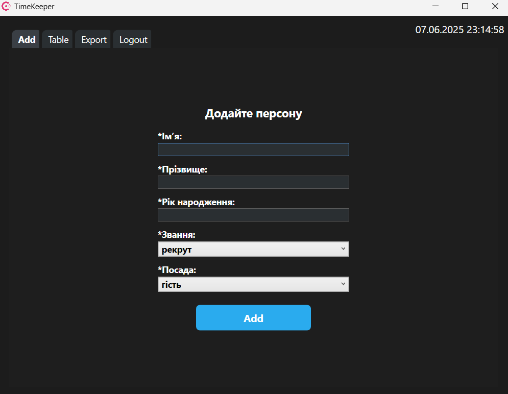

# ⏰ TimeKeeper

<div align="center">



    
</div>

## 📖 Опис проєкту

**TimeKeeper** — це корпоративний додаток, розроблений на платформі [.NET 8](https://dotnet.microsoft.com/en-us/), який використовує технологію [WPF](https://learn.microsoft.com/en-us/dotnet/desktop/wpf/) для створення сучасного десктопного інтерфейсу. Для зберігання даних застосовується реляційна база даних [MySQL](https://www.mysql.com/), а для організації асинхронної комунікації між компонентами — [RabbitMQ](https://www.rabbitmq.com/) з використанням бібліотеки [MassTransit](https://masstransit-project.com/).

Проєкт реалізує 24-годинний синхронний кеш для клієнтів (ПК). Таблиця `Persons` автоматично очищується (truncate) кожні 24 години за допомогою (event sheduler) в mysql для підтримки актуальності та швидкодії системи. Всі важливі дані зберігаються в логах у форматах `.log`, `.csv` та `.json` для подальшого аналізу та аудиту.

---

## 🛠 Технології

- **[.NET 8](https://dotnet.microsoft.com/en-us/)** — основна платформа розробки
- **[WPF (Windows Presentation Foundation)](https://learn.microsoft.com/en-us/dotnet/desktop/wpf/)** — технологія побудови UI
- **[MySQL](https://www.mysql.com/)** — реляційна база даних
- **[RabbitMQ](https://www.rabbitmq.com/)** — брокер повідомлень
- **[MassTransit](https://masstransit-project.com/)** — бібліотека для роботи з RabbitMQ
- Патерн проектування **MVC (Model-View-Controller)**  
- Принципи **ООП (Об’єктно-орієнтоване програмування)**  

---

## 🏛 Архітектура

Проєкт структурований за класичною трирівневою архітектурою із застосуванням патерну MVC для чіткого розділення відповідальностей:

### 1. **Model (Модель)**

- Відповідає за бізнес-логіку і роботу з даними.
- Основні класи:  
  - `Person.cs` — базовий клас, що описує сутність "Персона".  
  - `Staff.cs` — наслідний клас, що розширює функціонал `Person` для співробітників.
- Модель взаємодіє із базою даних MySQL через ORM або ADO.NET.

### 2. **View (Подання)**

- Відповідає за візуальне відображення інформації та взаємодію з користувачем.
- Реалізовано у вигляді WPF вікон та контролів.
- Логіка UI розбита по окремих класах, наприклад:  
  - `Windows.Btn.cs` — обробка подій кнопок, виклики відповідних команд і оновлення інтерфейсу.

### 3. **Controller (Контролер)**

- Посередник між View та Model.
- Обробляє події користувача, виконує валідацію, ініціює оновлення даних.
- Забезпечує комунікацію з сервісами, такими як MassTransit для обміну повідомленнями.

---

## 🗄 Система обробки даних

- Синхронізація з віддаленою базою даних здійснюється через RabbitMQ (MassTransit), що дозволяє ефективно обробляти великі об’єми повідомлень та забезпечувати актуальність даних у реальному часі.
- Щоденне очищення таблиці `Persons` (`TRUNCATE`) з метою збереження високої продуктивності та уникнення накопичення застарілої інформації.
- Важливі події і зміни логуються у форматах `.log`, `.csv`, `.json` для подальшого аудиту і аналізу.

---

## 📂 Структура проекту
```
/TimeKeeper
├─ /Models
  ├─ /Data
    ├─ PersonList.cs
  ├─ /DataBase # файли repository
  ├─ /Enum # використуємі перелічення
  ├─ /Queue # трансляція черги та її слухач
  ├─ /Utils # додаткові утиліти
  ├─ /View
    └─ DataGridService.cs # логіка відображення даних в DataGrid
  ├─ /Controllers
    └─ PersonController.cs # контролер для person
    └─ BlockUserController.cs # контролер для блокування users по sid
  ├─ /Controllers
    └─ Windows.Btn.cs # логіка кнопок та взаємодія з UI
  └─ README.md
```

#

<div align="center">

###  
[Security](./security.md) | [License ua](./license.ua.md) | [Changelog](./changelog.md) | [License ru](./license.ru.md) | [Contribution](./contribution.md) | [License en](./license.md) | [Code of conduct](./code_of_conduct.md) | [Releases](https://github.com/fxhxyz4/TimeKeeper/releases)

</div>
